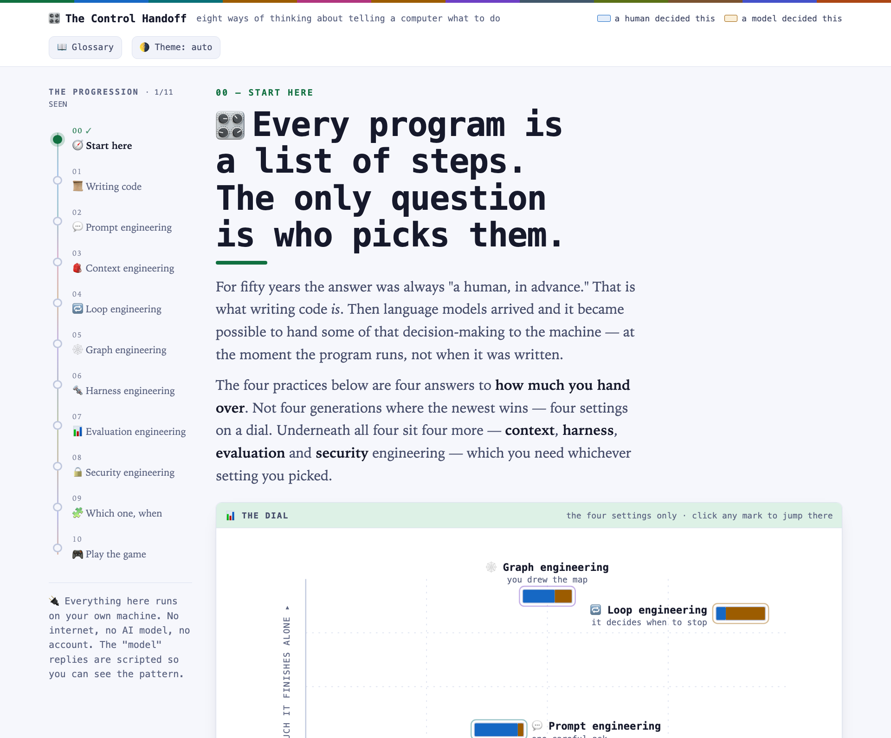

# 🎛️ The Control Handoff

**An interactive, illustrated introduction to agentic engineering — for people who are new to software engineering.**

Every program is a list of steps. The only question is *who picks them*. This page walks through eight answers to that question, and lets you **run every one of them yourself**.

**▶ [Open the live version](https://hudongpin.github.io/agent-edu/)** · no install, no account, no API key

It comes in two parts. **Part 1** is the page above: the mental model, in 45 minutes, with nothing to install. **Part 2** is [`course/`](course/): nine stages where you build the same café for real against the Claude API, and finish with an agent, an eval suite and a harness you wrote yourself.



---

## Just open the file

There is no build step, no `npm install`, no dev server.

```
git clone https://github.com/HUDongpin/agent-edu.git
open agent-edu/index.html
```

Or download `index.html` on its own and double-click it. It works offline, on a plane, on a school computer with the network locked down. Email it to someone and it still works.

**Nothing here is a real AI — by default.** Every "model" reply is scripted. That is deliberate: it keeps the patterns legible, makes the page free to run forever, and means it can never break because a key expired. The *behaviour* is faithful; the answers are not generated.

**Except one box, if you want it.** Section 02 has a ⚡ *live mode*: paste your own [DeepSeek](https://platform.deepseek.com/api_keys) key and the same prompt you assembled goes to a real model, so you can watch it come back different — and get checked against the real menu price. Your key lives in that browser tab (`sessionStorage`) and is gone when you close it; it goes to `api.deepseek.com` and nowhere else. Until you switch it on, the page makes **no outbound requests at all**.

---

## What's inside

The page is built around one spine: **who decides the next step, at the moment the program runs?**

Four settings on that dial, in order of how much control you hand over:

| | Section | You'll actually |
|---|---|---|
| 01 | 📜 **Writing code** | Watch a café kiosk fall over on `"a latte please"`, then add rules until you feel the wall |
| 02 | 💬 **Prompt engineering** | Toggle five prompt pieces and watch one prompt give five different answers |
| 04 | 🔁 **Loop engineering** | Step an agent through a restock job as it recovers from a missing tool and a rejected order |
| 05 | 🕸️ **Graph engineering** | Switch the reviewer off and watch an off-policy refund reach a real customer |

And four disciplines that sit underneath, whichever setting you picked:

| | Section | You'll actually |
|---|---|---|
| 03 | 🎒 **Context engineering** | Pack an 8,000-token window and discover that junk which *fits* still wrecks the answer |
| 06 | 🔩 **Harness engineering** | Run the night shift with the retries, timeouts and permission gates switched off |
| 07 | 📊 **Evaluation engineering** | A/B a prompt change over 20 cases and learn to tell a real win from noise |
| 08 | 🔒 **Security engineering** | Send an agent a poisoned email and watch it obey a stranger |

Plus **09 Which one, when** — a comparison table and a decision tree — and **10 Play the game**, ten real briefs where you pick the right tool and find out why the tempting answer was tempting.

### How it teaches

- **Every section opens by asking you to recall the last one** — from something you did with your hands, not something you read. The card is tinted in the colour of the section it reaches back to.
- **Every section closes with what it builds on and what it unlocks**, because the rail is a straight line but the subject isn't.
- **Shape *and* colour carry meaning** in all 19 flowcharts — ⬭ start/stop, ▭ fixed step, ▭ model decides, ▱ tool call, ◇ decision, ▭ failure — so the charts still read in greyscale or print.
- Runs about **45 minutes** end to end, or dip into any single section.

---

## Why one 219 KB file — on purpose

This is a deliberate architectural choice, not laziness or a missing build config. **Please don't split it into modules.**

- It has to survive being **downloaded, emailed, and opened offline** by someone with a locked-down machine. One file always does; a bundle usually doesn't.
- It has to still work **in five years**. No dependencies means nothing to rot, no `npm audit`, no lockfile, no CDN that quietly 404s.
- A learner can **read the whole source** — it is the teaching material *and* a worked example of a self-contained page.
- Zero external requests means **zero tracking**, which matters when it's put in front of a classroom. (The one exception is opt-in live mode, which calls DeepSeek only after you paste a key and press the button.)

Inside, it is organised in clear blocks: design tokens → base CSS → per-section CSS → HTML sections → a small SVG flowchart engine → one JS module per section.

---

## Contributing a section

New sections are genuinely welcome — *tool design*, *cost engineering* and *human-in-the-loop design* are all obvious gaps. Here's the whole recipe.

**1. Claim a colour.** Add three tokens in each of the three theme blocks near the top (`:root`, the `prefers-color-scheme: dark` media block, **and** `:root[data-theme="dark"]` — all three, or your section goes invisible when someone toggles the theme).

```css
--sage:#4A6B52;  --sage-soft:#E6EEE8;  --sage-line:#A8C4B0;
```

**2. Add a rail entry** and a `<section class="panel">` that sets `--sec` to your hue. Copy the shape of an existing section: eyebrow → `<h2>` with an emoji → `.rule` → thesis → *(the recall card and deps bar are injected automatically)* → method strip → plain-English box → mechanism flowchart → the interactive → three takeaways.

**3. Register it in the three tables** in the connective-tissue block, so the page can wire it up:

```js
SEC.yours    = {n:'09 Your engineering', c:'sage'};
DEPS.yours   = {on:['loop'], un:[], note:'optional cross-cutting note'};
RECALL.yours = {from:'graph', q:'…a question about something they DID…', a:'…the bridge into your section…'};
```

**4. Draw the diagrams** with the built-in engine — no library, no runtime:

```js
FC.strip($('#stripYours'), [['1 Do this','a subtitle'], /* …4 total… */ ], 'the loop-back caption');

FC.draw($('#fcYours'), {
  viewBox: '0 0 900 400',
  nodes: [{id:'a', type:'start', x:20, y:20, w:200, h:44, lines:['▶ begin'], fs:12}],
  edges: [{from:'a', to:'b', fs:'s', ts:'n', kind:'yes', label:'yes', lx:120, ly:90}]
});
```

`type` is one of `start · proc · model · tool · dec · out · err · idle`. Edges route orthogonally with rounded corners; `fs`/`ts` are the from/to sides (`n·s·e·w`), and `via:[{x,y},…]` overrides the automatic route when you need to steer around a box.

**5. Add a brief to the game** in the `BRIEFS` array, and your discipline to `A` and `ORDER`. Give it a `trap` explaining why the *wrong* answer is tempting — that field does most of the teaching.

### Before you open a PR

These are the checks used on every change to this page. Paste them into the browser console with the page open:

```js
// 1. no chart has text colliding with a box or spilling its viewBox
// 2. no edge passes through a node it isn't connected to
// 3. every text element clears 4.5:1 contrast in BOTH themes
// 4. the page never scrolls sideways at 390px wide
document.documentElement.scrollWidth <= document.documentElement.clientWidth + 1
// 5. every data-goto points at a real panel
[...document.querySelectorAll('[data-goto]')].map(b=>b.dataset.goto)
  .filter(g=>!document.getElementById('p-'+g))            // must be []
```

And the two that catch the most:

```bash
# the whole script block must parse
node --check <(sed -n '/<script>/,/<\/script>/p' index.html | sed '1d;$d')

# nothing may be LOADED from off-site. (<a href> links to GitHub are fine —
# this looks only at script/img/link, and ignores inline data: URIs.)
grep -o 'src="[^"]*"\|<link[^>]*href="[^"]*"' index.html | grep -v 'data:' || echo "clean"
```

**House style:** British spelling, sentence case in prose, no em-dash-free rewriting of existing copy just to match a linter. Prefer deleting a widget over adding one — the page has been trimmed once already for exactly that reason.

---

## Publishing your own copy

The live link is GitHub Pages serving this repo directly:

1. Name the file **`index.html`** in the repo root, so the URL is a clean `/`.
2. **Settings → Pages → Source: Deploy from a branch → `main` → `/ (root)` → Save.**
3. Wait a minute, then visit `https://<your-username>.github.io/<repo>/`.
4. If you fork it, update `og:url`, `og:image`, `twitter:image` and the two footer links in the `<head>` and footer — they point at this repo.

No workflow file and no `.nojekyll` are needed: a plain HTML file at the root is served as-is.

---

## Part 2 — [the hands-on course](course/)

Part 1 tells you *that* a loop recovers from a failed tool call. Part 2 has you write the loop and watch it happen, against a real model that really does give you a different answer to the same question.

| | Stage | What it teaches |
|---|---|---|
| 0–1 | hello · kiosk | your key works; the wall that rules hit |
| **2–3** | **prompt · evals** | **the same question, five answers — then how to measure that** |
| 4–5 | context · loop | most "bad model" is "never told"; then tools, failure, recovery |
| 6–8 | harness · graph · security | same model, four different mornings; request vs guarantee; input that gives orders |

It runs on **DeepSeek or Claude** with no stage changes — DeepSeek ships an Anthropic-compatible endpoint, so one SDK drives both. Running the same eval on two providers is the fastest way to learn which of your assumptions were really just one vendor's behaviour.

Python, one dependency, and **under 2 cents** of tokens end to end on `deepseek-v4-flash` (a few dollars on Claude Opus — same code either way, which is the point). `--offline` replays recorded answers if you have no key. Evals land third on purpose: once you have a number, every later change is a measurement instead of an argument.

## Licence

[MIT](LICENSE) — use it, fork it, translate it, put it in front of a class. Attribution appreciated but not required.

Built by [HU Dongpin](https://github.com/HUDongpin). Corrections and new sections welcome via [issues](https://github.com/HUDongpin/agent-edu/issues).
